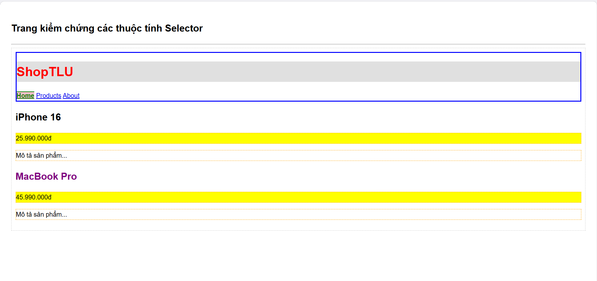

# PHẦN A — KIỂM TRA ĐỌC HIỂU (25 điểm)
## Câu A1 (5đ) — 3 Cách nhúng CSS
1. Inline CSS (Nhúng trực tiếp vào thẻ HTML)
Tập chữ thuộc tính style ngay bên trong thẻ mở của phần tử HTML cần định dạng.

Ví dụ code:
HTML

  Đoạn văn này được viết bằng Inline CSS nè cậu.

Ưu điểm: * Áp dụng style cực nhanh cho một phần tử duy nhất mà không cần mất công suy nghĩ đặt tên class hay id.

Rất tiện khi cần test nhanh một thuộc tính nào đó lúc đang gõ HTML.

Nhược điểm:

Làm code HTML cực kỳ rối mắt và lộn xộn nếu nhúng nhiều thuộc tính.

Không tái sử dụng được code, nếu có 10 đoạn văn muốn đổi màu giống nhau thì phải copy đoạn thuộc tính đó 10 lần.

Rất khó quản lý và bảo trì code sau này.

Khi nào nên dùng: Khi cần test nhanh thuộc tính, hoặc khi làm việc với JavaScript cần thay đổi trực tiếp style của một phần tử cụ thể một cách linh hoạt.

2. Internal CSS (Nhúng bằng thẻ , thông thường cặp thẻ này sẽ được đặt nằm trong phần <head> của trang HTML.

Ví dụ code:

HTML
<!DOCTYPE html>
<html lang="vi">
<head>
  <meta charset="UTF-8">
  <title>Ví dụ Internal CSS</title>
  
</head>
<body>
  <h1>Tiêu đề trang</h1>
  
Nội dung trang web viết bằng Internal CSS.

</body>
</html>
Ưu điểm:

Quản lý toàn bộ giao diện của một trang web tại một nơi duy nhất (trong thẻ <style>), giúp HTML bên dưới sạch sẽ hơn.

Có thể tái sử dụng các bộ chọn (class, id, tag) cho nhiều phần tử khác nhau trên cùng trang đó.

Nhược điểm:

Chỉ có tác dụng trên duy nhất 1 file HTML chứa nó. Nếu website của cậu có nhiều trang (như trang chủ, trang giới thiệu, trang liên hệ) thì cậu sẽ phải copy lại đoạn CSS đó sang các file khác.

Nếu code CSS quá dài, file HTML sẽ bị nặng và tải chậm hơn.

Khi nào nên dùng: Khi làm các bài tập nhỏ trên lớp, các trang Landing Page đơn lẻ hoặc các website chỉ có đúng một trang duy nhất.

3. External CSS (Nhúng file .css riêng biệt)
Viết toàn bộ code CSS vào một file hoàn toàn độc lập (có phần mở rộng là .css), sau đó kết nối file CSS đó vào file HTML bằng thẻ <link> đặt ở trong phần <head>.

Ví dụ code:

File style.css (File CSS riêng):

CSS
body {
  background-color: #f4f4f4;
  font-family: Arial, sans-serif;
}
.btn-submit {
  background-color: green;
  color: white;
  padding: 10px 20px;
  border: none;
}
File index.html (File HTML nhúng file CSS trên):

HTML
<!DOCTYPE html>
<html lang="vi">
<head>
  <meta charset="UTF-8">
  <title>Ví dụ External CSS</title>
  <link rel="stylesheet" href="style.css">
</head>
<body>
  <button class="btn-submit">Gửi dữ liệu</button>
</body>
</html>
Ưu điểm:

Giúp tách biệt hoàn toàn giữa cấu trúc dữ liệu (HTML) và giao diện hiển thị (CSS). Code cực kỳ sạch sẽ và chuẩn hóa.

Tái sử dụng tối đa: Một file CSS có thể dùng chung cho hàng trăm trang HTML khác nhau trong cùng một dự án.

Dễ dàng bảo trì, khi muốn đổi màu chủ đạo của cả website thì chỉ cần sửa đúng 1 dòng trong file CSS là xong.

Trình duyệt có thể lưu file CSS này vào bộ nhớ đệm (Cache), giúp các trang sau tải nhanh hơn rất nhiều.

Nhược điểm: Trình duyệt sẽ phải tốn thêm một lượt gửi yêu cầu (HTTP Request) để tải file CSS riêng đó về thì giao diện mới hiển thị đúng, nhưng rủi ro này là không đáng kể so với lợi ích mang lại.

Khi nào nên dùng: Đây là cách làm chuẩn mực và bắt buộc phải dùng khi làm các dự án, website thực tế hoặc các bài tập lớn có từ 2 trang web trở lên.

Trả lời câu hỏi thêm: Cách nào "thắng"?
Nếu một phần tử HTML cùng lúc bị áp dụng cả 3 cách CSS trên, kết quả là Inline CSS sẽ "thắng" (được ưu tiên hiển thị).

Giải thích lý do:
Quy tắc hoạt động của CSS dựa trên Độ ưu tiên (Specificity) và Thứ tự ưu tiên từ trên xuống (The Cascade):

Xét về Độ ưu tiên (Specificity): Trong hệ thống tính điểm ưu tiên của trình duyệt, Inline CSS có điểm số cao nhất (thường được quy ước điểm số là 1000), trong khi các bộ chọn class hay thẻ tag thông thường ở Internal và External CSS có điểm thấp hơn nhiều (chỉ khoảng 1 đến 10 điểm). Do đó, thuộc tính viết ngay trong thẻ luôn đè lên các thuộc tính viết ở ngoài.

Mối quan hệ giữa Internal và External: Hai cách này có độ ưu tiên ngang nhau (nếu dùng chung một kiểu bộ chọn selector). Lúc này, trình duyệt sẽ áp dụng quy tắc đọc từ trên xuống dưới, file nào hoặc đoạn code nào nằm ở dưới (đọc sau) sẽ ghi đè lên đoạn code nằm ở trên (đọc trước). Nhưng dù chúng có đổi chỗ cho nhau thế nào đi nữa, chúng vẫn phải xếp sau Inline CSS.

## Câu A2 (8đ) — CSS Selectors — Dự đoán kết quả
1. h1 → Chọn: Thẻ <h1> ở phần header.
Text content: ShopTLU

2. .price → Chọn: Cả 2 thẻ 
 có class price của hai sản phẩm.
Text content: 25.990.000đ và 45.990.000đ

3. #app header → Chọn: Toàn bộ khối <header> nằm trong thẻ 
 có id là app (bao gồm tất cả các thẻ con bên trong nó).
Text content gom lại là: ShopTLU Home Products About

4. nav a:first-child → Chọn: Thẻ <a> đầu tiên nằm trong thẻ <nav>.
Text content: Home

5. .product.featured h2 → Chọn: Thẻ <h2> nằm trong thẻ <article> nào có đồng thời cả 2 class là product và featured (chính là sản phẩm MacBook Pro).
Text content: MacBook Pro

6. article > p → Chọn: Tất cả các thẻ 
 là con trực tiếp của thẻ <article>. Tổng cộng chọn được 4 thẻ 
.
Text content gồm: 25.990.000đ, Mô tả sản phẩm... (của iPhone 16) và 45.990.000đ, Mô tả sản phẩm... (của MacBook Pro)

7. a[href="/"] → Chọn: Thẻ <a> có thuộc tính href mang giá trị chính xác là /.
Text content: Home

8. .top-bar.dark h1 → Chọn: Thẻ <h1> nằm bên trong phần tử có đồng thời 2 class là top-bar và dark.
Text content: ShopTLU

* Kiểm chứng đáp án: 

## Câu A3 (7đ) — Box Model — Tính toán kích thước
Trường hợp 1: content-box (mặc định)
Với cơ chế content-box, giá trị width: 400px chỉ áp dụng riêng cho vùng chứa nội dung (content). Khi render, trình duyệt sẽ cộng thêm padding và border ra bên ngoài.
Chiều rộng hiển thị = Width + Padding (trái + phải) + Border (trái + phải) = 400px + 20px × 2 + 5px × 2 = 450px
Không gian chiếm trên trang = Chiều rộng hiển thị + Margin (trái + phải) = 450px + 10px × 2 = 470px

Trường hợp 2: border-box
Với cơ chế box-sizing: border-box, giá trị width: 400px được cố định làm tổng chiều rộng của cả content, padding và border. Vùng content bên trong sẽ tự động bị bóp nhỏ lại.
Chiều rộng hiển thị = 400px (bằng đúng giá trị width đã khai báo)
Kích thước content thực tế = Width - Padding (trái + phải) - Border (trái + phải) = 400px - 20px × 2 - 5px × 2 = 350px
Không gian chiếm trên trang = Chiều rộng hiển thị + Margin (trái + phải) = 400px + 10px × 2 = 420px

Trường hợp 3: Margin collapse
Khoảng cách giữa box-a và box-b = 40px
Giải thích tại sao KHÔNG PHẢI 65px: Trong CSS, khi hai phần tử dạng khối (block) xếp chồng lên nhau theo chiều dọc, hiện tượng Sụp đổ lề (Margin Collapse) sẽ xảy ra. Lúc này, lề dưới (margin-bottom) của phần tử trên và lề trên (margin-top) của phần tử dưới sẽ hòa nhập lại thành một khoảng lề duy nhất chứ không cộng dồn lại với nhau. Trình duyệt sẽ so sánh và chọn lấy giá trị lớn nhất trong hai giá trị lề đó để hiển thị (ở đây là max(25px, 40px) = 40px).

Phần nâng cao:
Nếu .box-a có margin-bottom: -10px và .box-b có margin-top: 40px:
Khoảng cách giữa hai box = 30px
Giải thích: Khi hiện tượng sụp đổ lề xảy ra giữa một lề dương và một lề âm, trình duyệt sẽ tính toán khoảng cách thực tế bằng tổng đại số của chúng (lấy giá trị lề dương lớn nhất cộng với giá trị lề âm). Công thức tính cụ thể ở đây là: 40px + (-10px) = 30px.

## Câu A4 (5đ) — Specificity (Độ ưu tiên)
1. Tính specificity score (a, b, c) cho mỗi rule:
Quy ước tính điểm:
a: Số lượng ID selector (ví dụ: #main-price)
b: Số lượng Class selector, attribute selector, pseudo-class (ví dụ: .price)
c: Số lượng Element selector, pseudo-element (ví dụ: p)

Áp dụng vào các Rule:
Rule A (p): Chỉ có 1 thẻ HTML → Score: (0, 0, 1)
Rule B (.price): Chỉ có 1 class → Score: (0, 1, 0)
Rule C (#main-price): Chỉ có 1 ID → Score: (1, 0, 0)
Rule D (p.price): Có 1 class và 1 thẻ HTML → Score: (0, 1, 1)

2. Element sẽ có màu gì? Giải thích
Màu của element: Màu đỏ (red).
Giải thích: Trình duyệt sẽ so sánh điểm số từ trái qua phải (so sánh a trước, nếu bằng nhau mới xét đến b, rồi đến c).
Trong 4 rule trên, Rule C có điểm a = 1 (do dùng ID selector), trong khi các rule khác đều có a = 0. Vì ID selector có độ ưu tiên cao nhất vượt trội so với class và element nên Rule C sẽ "thắng" và element sẽ nhận màu đỏ của Rule C.

3. Nếu thêm 
, element có màu gì?
Màu của element: Màu cam (orange).
Giải thích: Thuộc tính style="..." gọi là Inline CSS (nhúng trực tiếp vào thẻ). Trong hệ thống phân cấp của CSS, Inline CSS luôn có độ ưu tiên cao hơn tất cả các bộ chọn viết trong file CSS bên ngoài hay trong thẻ <style> (nếu xếp vào hệ thống 4 số thì nó tương đương với điểm (1, 0, 0, 0)). Do đó nó sẽ đè lên màu đỏ của ID.

4. Nếu Rule A thêm !important, element có màu gì? Tại sao?
Màu của element: Màu đen (black).
Tại sao: Từ khóa !important trong CSS là một công cụ đặc biệt dùng để phá vỡ mọi quy tắc về độ ưu tiên thông thường. Khi cậu gắn !important vào sau thuộc tính color: black của Rule A, trình duyệt sẽ lập tức tối ưu và ưu tiên cho thuộc tính này lên mức cao nhất, đè bẹp cả ID selector lẫn Inline CSS (style="color: orange;"). Do đó element bắt buộc phải hiển thị màu đen.

# PHẦN B — THỰC HÀNH CODE (55 điểm)
## Bài B1 (20đ) — Style trang Profile
Danh sách 5 loại selector khác nhau đã sử dụng trong dự án:

Element Selector (Bộ chọn thẻ): Target trực tiếp vào các thẻ HTML để áp dụng style chung.
Ví dụ trong bài: body, header, footer

Class Selector (Bộ chọn lớp): Sử dụng dấu chấm (.) đi kèm tên class để định dạng cho các phần tử có class tương ứng.
Ví dụ trong bài: .active (dùng để làm nổi bật link trang hiện tại)

ID Selector (Bộ chọn định danh): Sử dụng dấu thăng (#) đi kèm tên id để định dạng cho một phần tử duy nhất.
Ví dụ trong bài: #skills-table (dùng để định dạng riêng cho bảng kỹ năng)

Descendant Selector (Bộ chọn hậu duệ): Kết hợp các bộ chọn cách nhau bằng dấu cách để target vào phần tử con nằm bên trong phần tử cha.
Ví dụ trong bài: nav a (chọn tất cả các thẻ <a> nằm bên trong thẻ <nav>)

Pseudo-class Selector (Bộ chọn lớp giả): Dùng để định dạng các trạng thái đặc biệt của phần tử khi có tác động từ người dùng hoặc theo vị trí cấu trúc.
Ví dụ trong bài: nav a:hover (khi di chuột qua link), tr:hover (khi di chuột qua dòng), và tr:nth-child(even) (chọn các dòng chẵn để làm hiệu ứng zebra)