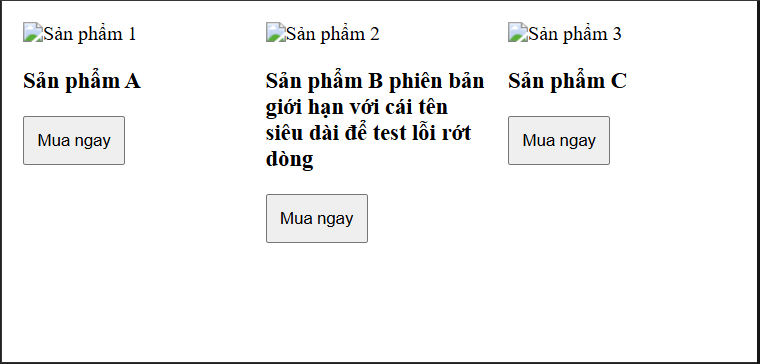
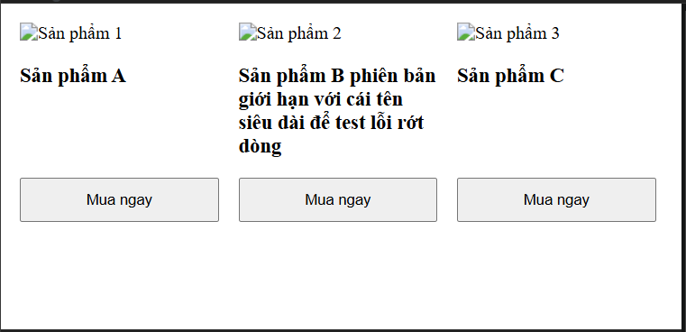
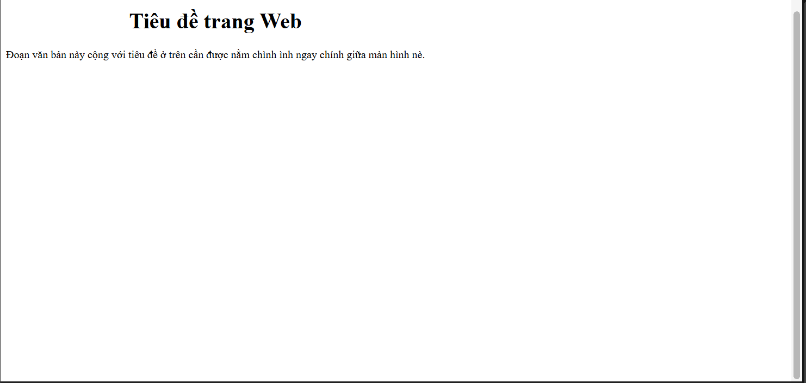
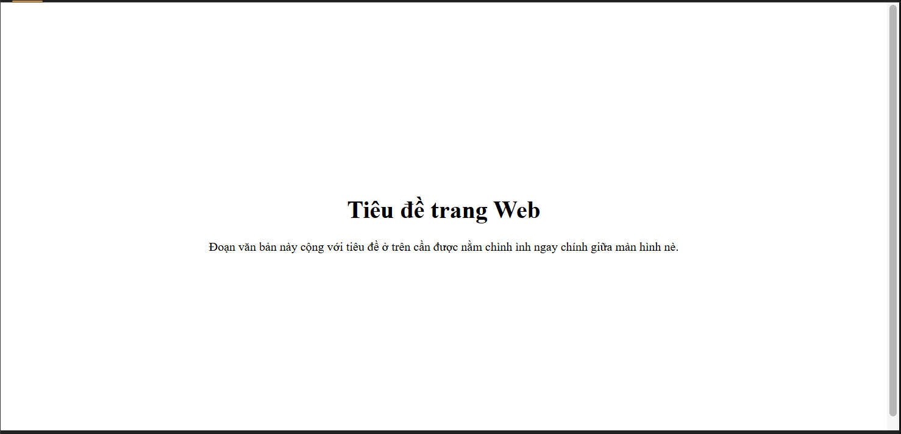
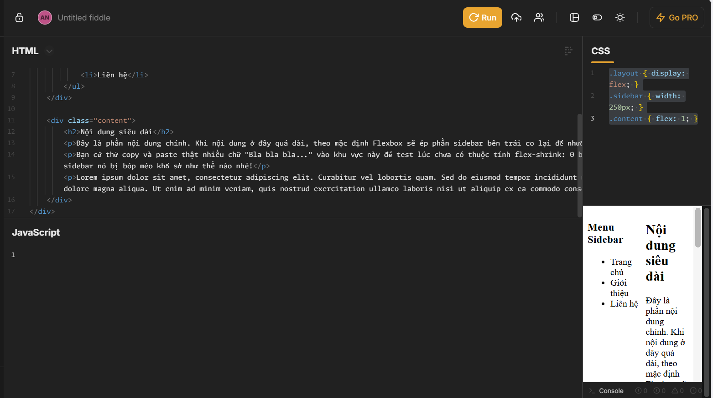
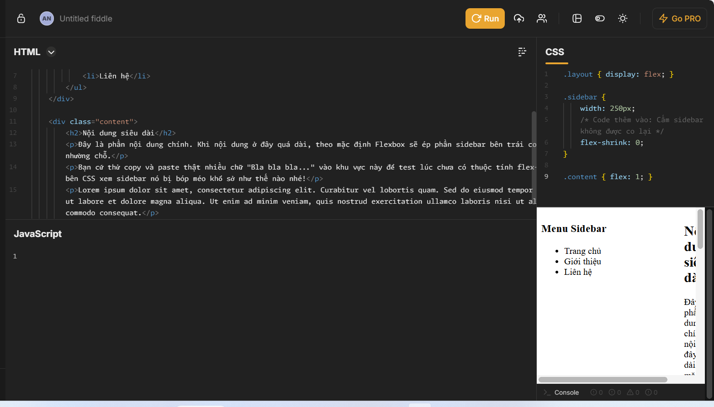

# PHẦN A — KIỂM TRA ĐỌC HIỂU (20 điểm)
## Câu A1 (10đ) — 5 Loại Positioning
| Position | Vẫn chiếm chỗ trong flow? | Tham chiếu vị trí | Cuộn theo trang? | Use cases (Ví dụ thực tế) |
| :--- | :--- | :--- | :--- | :--- |
| **static** | Có | Theo thứ tự viết code HTML (Normal flow). | Có | Mặc định của mọi thẻ HTML. Dùng khi cứ để các khối div xếp chồng lên nhau bình thường theo thứ tự tự nhiên. |
| **relative** | Có | Vị trí gốc ban đầu của chính nó. | Có | Dùng để dịch chuyển nhẹ một phần tử (bằng `top`, `left`...) mà không làm ảnh hưởng đến vị trí của các khối xung quanh. Hoặc cực kỳ hay dùng để làm "mỏ neo" (thẻ cha) cho một thẻ con dùng `absolute`. |
| **absolute** | Không (Bị bốc ra khỏi luồng bình thường, các thẻ khác sẽ tràn lên chiếm chỗ). | Thẻ tổ tiên gần nhất có position khác static (Nearest positioned ancestor). | Có (Nó sẽ cuộn theo phần tử cha bọc nó). | Đặt một cái icon "Hot" hoặc nhãn giảm giá đè lên góc của hình ảnh sản phẩm; làm các menu thả xuống (dropdown menu). |
| **fixed** | Không (Bị bốc ra khỏi luồng bình thường). | Viewport (Toàn bộ khung màn hình trình duyệt). | Không (Nó đứng im một chỗ, ghim chết trên màn hình khi cuộn trang). | Làm thanh menu điều hướng luôn nằm ở trên cùng trang web khi cuộn chuột (fixed header), hoặc nút "Quay lại đầu trang" nằm ở góc dưới bên phải. |
| **sticky** | Có (Ban đầu vẫn chiếm chỗ bình thường như relative, cuộn đến mốc mới đổi trạng thái). | Kết hợp giữa vị trí gốc ban đầu và Viewport (khi cuộn màn hình chạm mốc). | Có, khi cuộn qua vị trí của nó thì nó sẽ "dính" vào mốc đã set (ví dụ `top: 0`) giống như fixed, cho đến khi đi hết phạm vi của thẻ cha nó. | Làm thanh tiêu đề của bảng dữ liệu, hoặc thanh mục lục bên hông (sidebar) chạy dọc theo bài viết dài. |

* Trả lời câu hỏi thêm

1. Khi nào absolute tham chiếu body? Khi nào tham chiếu parent?
* **Tham chiếu parent:** Khi phần tử cha (hoặc các cấp cao hơn như ông, bà...) bọc ngoài nó có khai báo thuộc tính `position` là một trong các giá trị: `relative`, `absolute`, `fixed`, hoặc `sticky`. Lúc này nó sẽ lấy khung của thẻ cha đó làm gốc tọa độ.
* **Tham chiếu body:** Khi nó tìm ngược lên tất cả các thẻ bao bọc nó mà không thấy bất kỳ thẻ nào được set thuộc tính `position` cả (tức là mọi thẻ cha, ông... đều đang để mặc định là `static`). Khi không tìm được điểm tựa nào, nó buộc phải lấy khung ngoài cùng của trang web (thành phần chứa gốc, thường tương đương với body/viewport ban đầu) làm mốc tọa độ.

2. Giải thích khái niệm "nearest positioned ancestor"
* Cụm từ này dịch theo cách hiểu của tụi mình là: **"Phần tử tổ tiên gần nhất có thiết lập vị trí (khác static)"**.
* **Cơ chế hoạt động:** Khi một thẻ được đặt là `position: absolute`, trình duyệt cần tìm một hệ quy chiếu (gốc tọa độ) để đo khoảng cách cho các thuộc tính căn lề như `top`, `bottom`, `left`, `right`. Trình duyệt sẽ thực hiện tìm kiếm bằng cách đi ngược lên trên cây phân cấp HTML: đầu tiên là kiểm tra thẻ cha trực tiếp (parent), nếu cha không có position (đang là static) thì tìm tiếp lên thẻ ông (grandparent), rồi cứ thế đi lên tiếp. Thẻ tổ tiên nào **đầu tiên** mà trình duyệt bắt gặp có cấu hình thuộc tính `position` khác `static` thì sẽ bị chọn làm gốc tọa độ. Đó chính là "nearest positioned ancestor".

## Câu A2 (10đ) — Flexbox vs Grid
1. TH1: Dự đoán bố cục: 1 hàng, 4 cột kích thước bằng nhau.
Sơ đồ: 

+-------------------------------------------------------+
| [   Item 1   ] [   Item 2   ] [   Item 3   ] [   Item 4   ] |
+-------------------------------------------------------+

2. TH2: Dự đoán bố cục: 3 hàng, 2 cột.
Sơ đồ:

+-----------------------------------+
| [     Item 1     ] [     Item 2     ] |
| [     Item 3     ] [     Item 4     ] |
| [     Item 5     ] [     Item 6     ] |
+-----------------------------------+

3. TH3: Dự đoán bố cục: 1 hàng, 3 items bị đẩy dãn ra xa nhau, căn giữa theo chiều dọc.
Sơ đồ:

+-------------------------------------------------------+
| [Item 1]                    [Item 2]                   [Item 3] |
+-------------------------------------------------------+

4. TH4: Dự đoán bố cục: 1 hàng, 3 cột với kích thước là "Cố định - Co giãn - Cố định", có khoảng trống ở giữa.
Sơ đồ: 

+-------------------------------------------------------+
| [  200px  ]  [   1fr (Chiếm hết chỗ trống)   ]  [  200px  ] |
+-------------------------------------------------------+

5. TH5: Dự đoán bố cục: 3 hàng, 3 cột. Item cuối (thứ 7) nằm ở cột đầu tiên của hàng thứ 3.
Sơ đồ: 

+-----------------------------------+
| [ Item 1 ]   [ Item 2 ]   [ Item 3 ] |
| [ Item 4 ]   [ Item 5 ]   [ Item 6 ] |
| [ Item 7 ]   [ Trống  ]   [ Trống  ] |
+-----------------------------------+

# PHẦN C — SUY LUẬN (20 điểm)
## Câu C1 (10đ) — Flexbox vs Grid: Khi nào dùng gì?

1. Navigation bar ngang (logo + menu + buttons)
Lựa chọn: Flexbox
Giải thích: Thanh điều hướng chỉ sắp xếp các phần tử trên một đường thẳng (trục ngang). Dùng Flexbox với justify-content: space-between và align-items: center là cách hoàn hảo và nhanh nhất để đẩy Logo qua trái, Menu vào giữa và Button sang phải mà vẫn thẳng hàng tăm tắp.

2. Lưới ảnh Instagram (3 cột đều nhau, số ảnh không biết trước)
Lựa chọn: Grid
Giải thích: Vì yêu cầu là một lưới cố định đúng 3 cột (2 chiều: nhiều hàng, 3 cột), số lượng ảnh cứ đầy 3 cột là phải tự động rớt xuống hàng mới. Dùng display: grid với grid-template-columns: repeat(3, 1fr) sẽ ép các ảnh thành một khung lưới hoàn hảo, chia đều đặn mà không bị xô lệch như Flexbox.

3. Layout blog: main content + sidebar
Lựa chọn: Grid (hoặc kết hợp cả hai, nhưng Grid là chính)
Giải thích: Đây là "macro-layout" (bố cục lớn của toàn trang). Grid sinh ra để dựng khung xương trang web. Ta có thể dễ dàng chia lưới, ví dụ đặt cột Main Content là 1fr (chiếm phần dư) và Sidebar là 300px cố định. Flexbox cũng làm được nhưng Grid xử lý phần khung to này khoa học và kiểm soát dễ hơn nhiều.

4. Footer với 4 cột thông tin (Về chúng tôi, Liên kết, Hỗ trợ, Liên hệ)
Lựa chọn: Grid
Giải thích: Giống như chia lưới ảnh, khi bạn muốn chia giao diện thành các "cột" (columns) rõ ràng và bằng nhau trên một hàng, dùng Grid với grid-template-columns: repeat(4, 1fr) là nhanh và chắc cú nhất. Nó đảm bảo 4 cột luôn có chiều ngang bằng nhau bất kể lượng chữ bên trong ít hay nhiều.

5. Card sản phẩm (ảnh trên, text giữa, nút dưới — nút luôn dính đáy)
Lựa chọn: Flexbox
Giải thích: Đây là tình huống y hệt như bài B2 bọn mình vừa code. Nội dung trong card được xếp theo 1 trục dọc. Ta sẽ dùng Flexbox với flex-direction: column. Để cái nút luôn dính xuống đáy, chỉ cần kết hợp gán margin-top: auto cho nút đó là xong, không cần đến Grid vì đây là chi tiết nhỏ (micro-layout) và chỉ nằm trên 1 chiều.

## Câu C2 (10đ) — Debug Flexbox

1. Lỗi 1: Cards không đều chiều cao — nút "Mua" bị nhảy lên/xuống
Nguyên nhân: Khối bọc ngoài .card-container dùng display: flex nên các thẻ .card tự động có chiều cao bằng nhau (nhờ align-items: stretch mặc định). Tuy nhiên, bên trong nội bộ từng thẻ .card lại chưa dùng Flexbox. Do đó, nếu tên sản phẩm (h3) bên này dài hơn bên kia, phần nội dung sẽ đẩy cái nút "Mua" (.btn) xuống các vị trí lộn xộn, không nằm thẳng hàng nhau ở dưới đáy.

- Code sửa: 

.card-container { display: flex; flex-wrap: wrap; }

.card { 
    width: 30%; 
    margin: 1.5%; 
    display: flex; 
    flex-direction: column; 
}

.card img { width: 100%; }
.card h3 { font-size: 18px; }

.card .btn { 
    padding: 10px; 
    margin-top: auto; 
}

- screenshot: 
Trước: 
Sau: 

2. Lỗi 2: Muốn items nằm giữa cả ngang lẫn dọc trong container 100vh, nhưng item vẫn dính góc trái trên
Nguyên nhân: Khối .hero mới chỉ được khai báo display: flex; nhưng lại thiếu mất các thuộc tính căn chỉnh. Thuộc tính text-align: center; ở .hero-content chỉ có tác dụng căn giữa phần chữ (văn bản) ở bên trong cái hộp đó, chứ không thể nhấc cả cái hộp đó đặt vào giữa khung .hero được.

- Code sửa:

.hero {
    height: 100vh;
    display: flex;
    /* Code thêm vào: Căn giữa ngang và dọc */
    justify-content: center;
    align-items: center; 
}

.hero-content {
    text-align: center; /* Vẫn giữ để chữ bên trong được căn giữa */
}

- screenshot: 
Trước: 
Sau: 

3. Lỗi 3: Sidebar bị co lại khi content quá dài
Nguyên nhân: Đây là một đặc tính mặc định của Flexbox: các item sẽ tự động co lại (flex-shrink: 1) nếu không gian chứa không đủ. Khi cột .content chứa quá nhiều chữ hoặc hình ảnh to, nó sẽ phình ra và ép cột .sidebar phải thu hẹp lại, nhỏ hơn cả kích thước 250px ban đầu mà ta đã set.

- Code sửa:

.layout { display: flex; }

.sidebar { 
    width: 250px; 
    /* Code thêm vào: Cấm sidebar không được co lại */
    flex-shrink: 0; 
}

.content { flex: 1; }

- screenshot: 
Trước: 
Sau: 