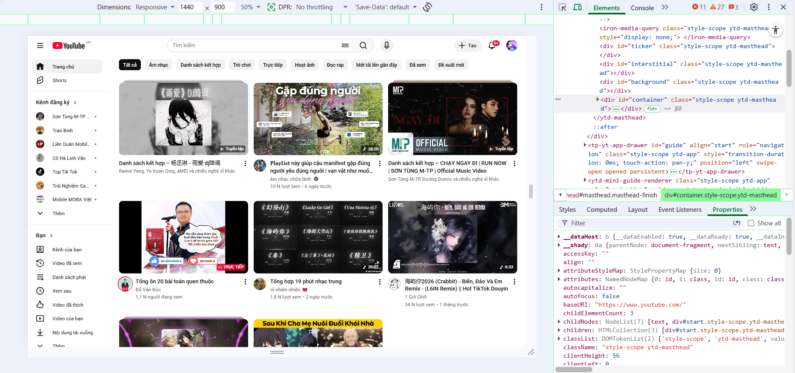
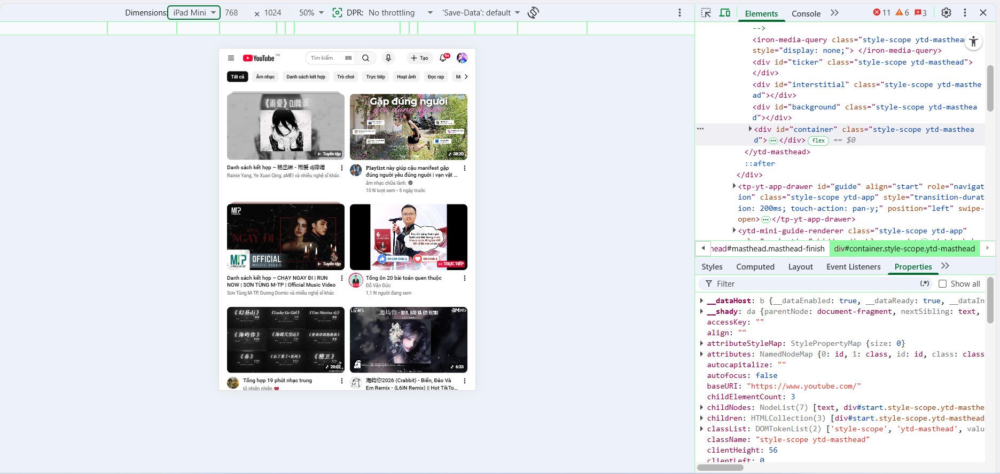
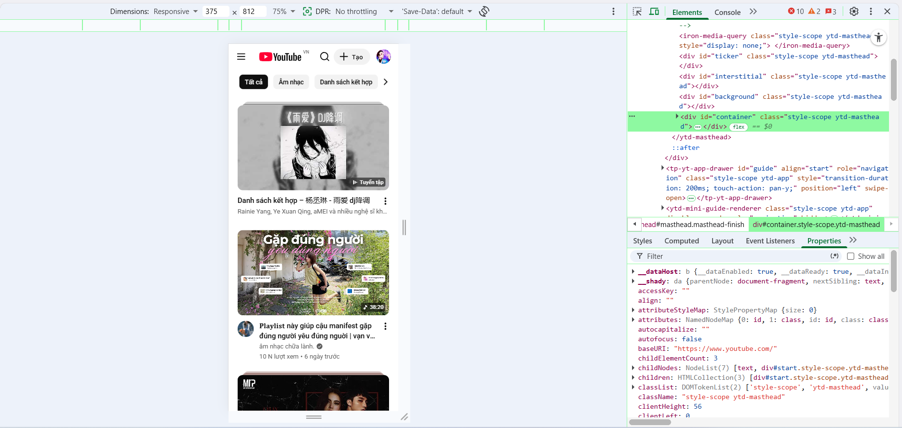

# PHẦN A — KIỂM TRA ĐỌC HIỂU (20 điểm)
## Câu A1 (5đ) — Viewport & Mobile-First
1. Thẻ <meta viewport> chuẩn:
    <meta name="viewport" content="width=device-width, initial-scale=1.0">

- Giải thích từng thuộc tính:
+ name="viewport": Báo cho trình duyệt biết đây là thẻ dùng để kiểm soát vùng hiển thị (khung nhìn) của trang web.
+ width=device-width: Yêu cầu trình duyệt đặt chiều rộng của trang web bằng đúng với chiều rộng thực tế của màn hình thiết bị (điện thoại, tablet...).
+ initial-scale=1.0: Đặt mức độ thu phóng ban đầu khi vừa load trang là 100% (không phóng to cũng không thu nhỏ).

2. Nếu thiếu thẻ này, Iphone sẽ hiển thị trang web:
Lúc đó, nó sẽ tự động render trang web với chiều rộng mặc định của desktop (thường rơi vào khoảng 980px). Sau đó, nó sẽ "bóp" (scale down) toàn bộ trang web lại để nhét cho vừa vặn vào cái màn hình bé tí của điện thoại. Hậu quả là toàn bộ chữ, hình ảnh, nút bấm sẽ nhỏ xíu, người dùng không thể nào đọc được trừ khi họ dùng hai ngón tay để zoom (phóng to) trang web lên.

3. Sự khác nhau của Mobile-First và Desktop-First:
Mobile-First (Ưu tiên mobile): Bạn viết CSS mặc định cho màn hình điện thoại trước. Sau đó dùng breakpoint min-width để "nâng cấp" thêm layout, thêm chi tiết khi màn hình to ra (Tablet, PC).

Desktop-First (Ưu tiên desktop): Bạn viết CSS mặc định cho màn hình máy tính to đùng trước. Sau đó dùng breakpoint max-width để giấu bớt phần tử, bóp nhỏ layout lại khi màn hình bé đi.

- Ví dụ CSS với breakpoint 768px
Cách 1: Code theo kiểu Mobile-First (Dùng min-width)

/* Code mặc định dành cho màn hình nhỏ (Mobile) */
.container {
    width: 100%;
    display: block; /* Các item xếp dọc */
}

/* Khi màn hình lớn hơn hoặc bằng 768px (Tablet trở lên) thì áp dụng thêm code này */
@media (min-width: 768px) {
    .container {
        display: flex; /* Đổi sang xếp ngang cho màn hình to */
    }
}

Cách 2: Code theo kiểu Desktop-First (Dùng max-width)

/* Code mặc định dành cho màn hình to (Desktop) */
.container {
    width: 100%;
    display: flex; /* Các item xếp ngang */
}

/* Khi màn hình nhỏ hơn hoặc bằng 768px (Mobile) thì áp dụng code này để ghi đè */
@media (max-width: 768px) {
    .container {
        display: block; /* Ép nó xếp dọc lại cho vừa màn hình điện thoại */
    }
}

- Tại sao Mobile-First được khuyên dùng?
+ Tối ưu hiệu suất (Performance): Điện thoại thường có cấu hình yếu hơn và mạng chậm hơn máy tính. Nếu dùng Mobile-First, điện thoại chỉ cần đọc đoạn CSS mặc định nhẹ nhàng ở trên cùng là chạy được ngay. Còn nếu dùng Desktop-First, điện thoại sẽ phải tải toàn bộ CSS đồ sộ của máy tính, rồi lại phải tốn sức đọc thêm đoạn @media để ghi đè/xóa bớt định dạng, làm web load chậm hơn.

+ Tập trung vào tính năng cốt lõi: Màn hình điện thoại rất nhỏ, bắt buộc người code phải suy nghĩ xem cái gì là quan trọng nhất để giữ lại, giúp UX (trải nghiệm người dùng) gọn gàng và đi thẳng vào trọng tâm hơn.

## Câu A2 (5đ) — Breakpoints

| Breakpoint (Tên gọi) | Kích thước pixel | Thiết bị đại diện | Ví dụ: Lưới sản phẩm (Số cột) |
| :--- | :--- | :--- | :--- |
| **X-Small (xs)** | `< 576px` | Điện thoại di động (cầm dọc) | 1 cột (ảnh to dãn hết màn hình, dễ lướt ngón tay bấm mua) |
| **Small (sm)** | `>= 576px` | Điện thoại (cầm ngang) hoặc Tablet nhỏ | 2 cột |
| **Medium (md)** | `>= 768px` | Tablet (như iPad cầm dọc) | 3 cột |
| **Large (lg)** | `>= 992px` | Màn hình máy tính (Laptop/Desktop nhỏ) | 4 cột |
| **Extra Large (xl)** | `>= 1200px` | Màn hình Desktop lớn | 4 hoặc 5 cột |
| **Extra Extra Large (xxl)** | `>= 1400px` | Màn hình siêu rộng (Màn hình cong, TV) | 5 hoặc 6 cột |

## Câu A3 (5đ) — Media Queries

| Chiều rộng màn hình | `.container` width |
| :--- | :--- |
| **375px (iPhone SE)** | **100%** |
| **600px** | **540px** |
| **800px** | **720px** |
| **1000px** | **960px** |
| **1400px** | **1140px** |

## Câu A4 (5đ) — SCSS Basics

1. Variables ($primary-color)

Giải thích: Giống hệt như học lập trình C hay Python, SCSS cho phép mình tạo ra các "biến" (bắt đầu bằng dấu $) để lưu trữ những giá trị dùng đi dùng lại nhiều lần như mã màu, kích thước font chữ, khoảng cách... Nếu sau này sếp bảo đổi màu chủ đạo của web, mình chỉ cần sửa ở 1 chỗ duy nhất khai báo biến là toàn trang tự cập nhật, không cần Ctrl + F đi tìm sửa từng dòng nữa.

Ví dụ:

SCSS
/* Khai báo biến */
$primary-color: #3498db;
$font-stack: Helvetica, sans-serif;

body {
  font-family: $font-stack;
  color: $primary-color;
}

2. Nesting (viết CSS lồng nhau)

Giải thích: Code CSS thuần thì các thẻ con phải viết tách rời và lặp lại tên thẻ cha rất dài dòng. Với SCSS, mình được viết các thẻ con lồng thẳng vào bên trong ngoặc nhọn {} của thẻ cha, y hệt như cấu trúc cây phân cấp của HTML. Nhìn vào là biết ngay thằng nào con thằng nào.

Ví dụ:

SCSS
nav {
  background-color: #333;
  
  ul { /* ul nằm trong nav */
    margin: 0;
    
    li { /* li nằm trong ul */
      list-style: none;
    }
  }
}

3. Mixins (@mixin, @include)

Giải thích: Mixin hoạt động giống hệt như một "hàm" (function) trong lập trình. Nó cho phép bạn gom một cụm các thuộc tính CSS lại thành một cục, đặt tên cho nó bằng @mixin. Chỗ nào cần dùng thì gọi nó ra bằng @include. Đỉnh nhất là Mixin có thể nhận tham số truyền vào để thay đổi linh hoạt.

Ví dụ:

SCSS
/* Tạo mixin căn giữa bằng flexbox */
@mixin flex-center($direction: row) {
  display: flex;
  justify-content: center;
  align-items: center;
  flex-direction: $direction;
}

.box {
  @include flex-center(column); /* Gọi mixin và truyền tham số cột */
  width: 200px;
}

4. @extend / Inheritance

Giải thích: Tính năng này cho phép một class "vay mượn" (kế thừa) toàn bộ các thuộc tính CSS của một class khác. Rất hữu ích khi làm các nút bấm (buttons) hay hộp thông báo (alerts) có thiết kế gốc giống nhau, chỉ khác mỗi cái màu nền.

Ví dụ:

SCSS
/* Class gốc */
.btn-base {
  padding: 10px 20px;
  border-radius: 5px;
  border: none;
}

/* Class con kế thừa class gốc và thêm màu riêng */
.btn-success {
  @extend .btn-base;
  background-color: green;
}

.btn-danger {
  @extend .btn-base;
  background-color: red;
}

* Trình duyệt không đọc được file .scss do: 
Trình duyệt (Chrome, Safari, Edge...) thực ra rất "cứng nhắc". Động cơ (engine) của chúng từ trước đến nay chỉ được lập trình để hiểu đúng 3 ngôn ngữ cốt lõi: HTML, CSS và JavaScript.

SCSS là một "ngôn ngữ tiền xử lý" (Preprocessor). Nó sinh ra để cho lập trình viên (con người) viết code nhanh hơn, tư duy logic hơn. Trình duyệt không hề biết dấu $, @mixin hay @extend là cái gì cả. Nếu ném trực tiếp file .scss lên web, trình duyệt sẽ báo lỗi cú pháp ngay.

* Các bước để chuyển từ scss -> css
Chúng ta cần một bước gọi là Biên dịch (Compilation/Transpiling).
Hiểu đơn giản là cần một công cụ trung gian (như một phiên dịch viên) để đọc file .scss của tụi mình, giải mã các biến, bung các thẻ lồng nhau ra, và dịch nó về thành file .css thuần túy dài ngoằng, đúng chuẩn mực để trình duyệt có thể đọc hiểu.

# PHẦN B — THỰC HÀNH CODE
## Bài B3 (20đ) — SCSS Refactor

1. Lệnh biên dịch SCSS → CSS (Dùng Terminal/Command Line)

Nếu bạn đã cài đặt Sass trên máy (thông qua Node.js/npm), bạn mở Terminal lên và chạy lệnh sau:

```bash
sass scss/style.scss style.css
```

**Giải thích:** * `sass`: Gọi trình biên dịch Sass.
* `scss/style.scss`: Đường dẫn tới file SCSS chính cần dịch.
* `style.css`: Tên file CSS đầu ra (trình duyệt sẽ đọc file này).

Để Sass tự động dịch mỗi khi bạn bấm lưu file (Ctrl+S) mà không cần gõ lại lệnh, thêm cờ `--watch`:
```bash
sass --watch scss/style.scss style.css
```

---

# PHẦN C — PHÂN TÍCH (20 điểm)
## Câu C1 (10đ) — Phân tích trang web thực





1. Navigation (Thanh điều hướng) thay đổi thế nào?

Desktop (1440px): Giao diện đầy đủ nhất. Sidebar (menu điều hướng bên trái) đang được mở rộng, hiển thị rõ tên các mục (Trang chủ, Shorts, Kênh đăng ký...). Trên Header có thanh search (tìm kiếm) dạng ô nhập text rất dài.

Tablet (768px): Sidebar bên trái đã bị ẩn đi hoàn toàn để nhường chỗ cho nội dung video, thu gọn lại thành nút Hamburger (icon 3 gạch ngang) ở góc trái trên cùng.

Mobile (375px): Header tối giản đi rất nhiều. Khung nhập text tìm kiếm dài sọc đã biến mất, thay bằng một icon kính lúp nhỏ. Thanh menu chứa các filter tag (Tất cả, Âm nhạc...) bị bóp chiều ngang lại thành dạng scroll (cuộn ngang).

2. Lưới content (Grid) thay đổi mấy cột?
Nhìn vào danh sách video hiển thị, ta thấy rất rõ sự thay đổi số lượng cột lưới:

Desktop (1440px): Lưới chia làm 4 cột video rộng rãi.

Tablet (768px): Lưới giảm xuống còn 2 cột video lớn.

Mobile (375px): Lưới chỉ còn 1 cột duy nhất, mỗi video tràn viền chiếm trọn 100% chiều ngang màn hình để dễ xem nhất trên điện thoại.

3. Elements nào bị ẩn trên mobile?

Thanh Sidebar Menu bên trái (bị ẩn đi, chỉ khi bấm vào hamburger mới trượt ra).

Ô nhập liệu (input text field) của thanh tìm kiếm ở giữa màn hình.

Chữ "+ Tạo" trên góc phải màn hình đã bị ẩn đi, chỉ giữ lại mỗi icon dấu cộng.

4. Font size có thay đổi không?

Có thay đổi. Trên giao diện mobile (375px), font chữ của tiêu đề video và tên kênh trông được thu nhỏ hơn một chút so với bản Desktop. Mục đích là để hạn chế việc chữ bị rớt xuống quá nhiều dòng gây tốn diện tích màn hình. Kích thước chữ ở các nút filter (Tất cả, Âm nhạc...) cũng được làm nhỏ lại.

## Câu C2 (10đ) — Thiết kế Responsive Strategy

1. Phân tích & Vẽ Wireframe (Sơ đồ bố cục)

* Giao diện Mobile (Dưới 768px)

Sơ đồ từ trên xuống: Header -> Hero Image -> Form Đặt bàn -> Grid 6 ảnh món ăn -> Bản đồ Maps -> Footer.

Câu hỏi:

Những gì bị ẩn? Chữ "Số điện thoại" hoặc giờ mở cửa trên Header sẽ bị ẩn đi, chỉ giữ lại Logo và một cái Icon điện thoại (bấm vào là gọi luôn). Hero image có thể sẽ bị cắt gọn lại (crop) để không chiếm quá nhiều chiều cao màn hình.

Form nằm đâu? Form nằm ngay dưới Hero Image, chiếm 100% chiều ngang (1 cột duy nhất). Lý do: Khách vào bằng điện thoại thường đang vội và muốn đặt bàn ngay, đẩy Form lên đầu sẽ giúp họ không phải cuộn mỏi tay qua 6 cái ảnh mới thấy chỗ đặt.

* Giao diện Tablet (Từ 768px đến dưới 1024px)

Sơ đồ từ trên xuống: Header -> Hero Image -> Grid 6 ảnh món ăn -> Khu vực Đặt bàn & Maps -> Footer.

Câu hỏi:

Grid ảnh mấy cột? Sẽ là 3 cột (3 cột x 2 hàng = 6 ảnh). Kích thước Tablet đủ rộng để xem 3 ảnh một hàng mà không bị quá nhỏ.

Bản đồ nằm đâu? Bản đồ nằm ngang hàng (bên cạnh) Form đặt bàn. Lúc này mình sẽ dùng Grid chia khu vực dưới cùng thành 2 cột: Cột trái là Form đặt bàn, cột phải là Google Maps nhúng vào (Tỉ lệ 1:1) nhìn cực kỳ cân đối.

* Giao diện Desktop (Từ 1024px trở lên)

Sơ đồ bố cục tổng thể: Header -> Cụm Nội Dung (chia làm 2 phần trái/phải) -> Footer.

Câu hỏi:

Layout bao nhiêu cột? Khu vực thân trang (chứa Hero, Grid, Form, Map) sẽ được chia làm 2 cột lớn theo tỉ lệ khoảng 7:3 (hoặc 8:4).

Sidebar có không? Có! Cột nhỏ bên phải (30% width) sẽ được dùng làm Sidebar chứa Form đặt bàn. Mình sẽ set cho Form này thành dạng sticky (dính chặt trên màn hình khi cuộn). Cột lớn bên trái (70% width) sẽ chứa Hero Image, Grid 6 ảnh món ăn (vẫn 3 cột ảnh) và Google Maps nằm ngay dưới. Cách chia này giúp người dùng dù có cuộn xuống xem món ăn hay bản đồ thì Form đặt bàn vẫn luôn "đập vào mắt" ở bên phải.

* CSS skeleton
/* =========================================
   1. MOBILE FIRST (Mặc định cho màn hình nhỏ)
   ========================================= */
/* Bố cục tổng từ trên xuống dưới dạng 1 cột */
.wrapper {
  display: grid;
  grid-template-columns: 1fr;
  gap: 20px;
}

header {
  /* Logo trái, Icon điện thoại phải */
  display: flex;
  justify-content: space-between;
}

.food-grid {
  display: grid;
  /* Mobile để 2 cột ảnh nhìn cho rõ, hoặc 1 cột tùy ý */
  grid-template-columns: repeat(2, 1fr); 
  gap: 10px;
}

.booking-and-map {
  display: grid;
  grid-template-columns: 1fr; /* Form trên, Map dưới */
  gap: 20px;
}

/* =========================================
   2. TABLET (Từ 768px trở lên)
   ========================================= */
@media (min-width: 768px) {
  
  .food-grid {
    /* Mở rộng lên 3 cột cho 6 ảnh (3x2) */
    grid-template-columns: repeat(3, 1fr);
  }

  .booking-and-map {
    /* Đẩy Form sang trái, Map sang phải (2 cột bằng nhau) */
    grid-template-columns: 1fr 1fr; 
  }
}

/* =========================================
   3. DESKTOP (Từ 1024px trở lên)
   ========================================= */
@media (min-width: 1024px) {
  
  /* Thay đổi bố cục cả trang thành có Sidebar */
  .wrapper {
    grid-template-columns: 2fr 1fr; /* Trái 2 phần, Phải 1 phần */
    /* Cột 1: Header, Hero, Grid, Map */
    /* Cột 2: Form đặt bàn (Sidebar) */
  }

  /* Định vị các thành phần vào cột lưới (Ví dụ) */
  header, footer {
    grid-column: 1 / -1; /* Header và Footer vẫn full chiều ngang */
  }

  .main-content {
    grid-column: 1 / 2; /* Chứa Hero, Grid, Map ở cột trái */
  }

  .sidebar-form {
    grid-column: 2 / 3; /* Form đặt bàn nằm ở cột phải */
    position: sticky;
    top: 20px; /* Cuộn trang form vẫn giữ nguyên vị trí */
  }
}